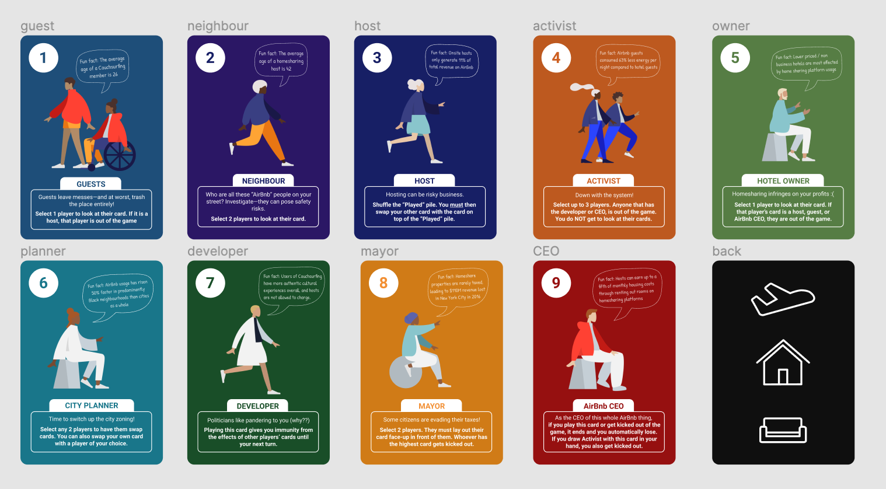

This was by far my favourite course of the term. It is called Design, Systems, and Society. I really enjoyed all the readings, the assignments, group projects, and lectures. The course was designed very well!  - And I'm not just saying this, I genuinely really enjoyed spending time on this course. 

The design courses remind me of exactly why I picked Systems Design Engineering in the first place, as sometimes a lot of the enjoyment and motivation can be lost in the slew of all the core math and science courses we need to take. 

Everything in this course was really applicable to me and I liked that we got to analyze the social and environmental aspects of tech. There were no exams in this course. Everything was broken down into projects along with small quizzes for the readings. 

I really enjoyed the textbook readings as well, especially the topics of ethical dilemnas of technology, inequality and how exposure to tech varies across generations and race, surveillance, and more. The quizzes weren't much to stress over since they were based on the textbook readings and it was nice to write about how two different concepts connect. We also had weekly discussion boards as well.

## Assignments

Now for the assignments, they were split up into two projects. The first project was called "Current Technology" where we analyzed its impacts on primary users, secondary users, local + global society, and the environment. My group chose homesharing, which is right up my alley since my mom is actually an AirBnB host, so it's cool learning more about the technology that has impacted our lives so much. 

The first part of this project was writing a summary report on the impacts of this technology, and recommendations on how to deal with the negative impacts of the technology. This really opened my eyes up to all aspects of the homesharing industry - I mainly see the benefits and negative impacts on the user side, but seeing how homeshairng affects rent prices, the environment, and our society taught me a lot about the industry.

Now for the second part of project 1, we got to create a game! The goal was this to use gamification to teach our classmates about our current technology. As someone who really likes games and design (I taught at a game camp before coming to university) this was perfect! It was really great to see everything we learned come full circle, as in our earlier design courses in first year we learned about design process (needs assessment, persona, multiple design concepts, constraints + requirements, prototypes, and user testing). 

My team and I ended up taking a spin on the love letter game and created *Eviction Notice.* This game allowed people to learn more about the impacts and power the different stakeholders in the homesharing industry have as each card had a certain action that related to the stakeholder's role in homesharing. For example: the nosy neighbour could see other player's cards, the hotel owner could kick out the AirBnB owners, guests could trash the host's airbnb, etc. The game was actually really fun and my team really enjoyed playing it in all of our meetings! 

It was also cool to see in the user testing to measure how much people learned about the industry after playing our game, helping us learn to iterate and design games to help educate. The best part of this was that we also got to play games with other groups in our class, with organized game play sessions. A lot of them were very unique and was such a fun break from all my other classes. It was really great to see teams make the use of digital tools such as Figma to design such seamless game play experiences.

---
*These were the designs of the games by my group!*

*This is an example of another team's game, where their emerging technology was ridesharing. It can actually be played at [https://ride-or-die.netlify.app/game](https://ride-or-die.netlify.app/game).*

---

## Navigating group work
This is a little grattitude section - if anyone in my group ends up finding this page, I really enjoyed working with my team! The groups for SYDE 261 were all randomized, so it really could be a hit or miss. I was so glad that I ended up being on a team where everyone was so proactive and had such creative ideas surrounding the game design. When working with a new group of people, I find that it's really helpful setting expectations up front on what everyone wants out of the project. Here are a few tips I learned: 
- **Ask your team: What grade do we want on the project?** If everyone wants to do well, this will be a key motivator in making sure everyone gets their work done. 
- **Learn people's working styles** Are they deadline driven (only start work closer to when it's due) or are they more proactive? If you know that people are more deadline driven (*and you are not!*), try to give your team artificial deadlines on when you want parts of the project done
- **Meet regularly**: having regular syncs with your team is the easiest way to get everyone on the same page. It depends on the team, but especially in new groups, people tend to get left on read when messaging in the chat. Everyone else is busy with co-op applications and the burden of their other courses. Carving out that time for a meeting gives everyone that focus time for 261, and also helps emphasize smaller deadlines you have within a team. - Most people wouldn't want to show up to the next team meeting without having anything to show with progress on the project. Don't just meet in the start and end where you simply lay out tasks and then have the final check in when everything is due. 
- **Break things down into smaller tasks**: Breaking the large task of the group project into smaller sub-tasks really made it a lot more manageable. The first meeting with my team, I took on the "PM" hat and laid out a timeline for the research we needed for our report, and when we wanted to get things done by. Although the final report was due 2 months away, there were a lot of tasks such as game ideation, game design, user testing etc. which would take a lot of time. We tried to plan backwards and gave ourselves the breathing room to be more flexible with 261 work when we have midterms/physics assesments. Here is an example of the deliverables table in my group google doc: 
 
- **Have fun!** The best part of working with groups is having fun while you're doing it! My team spent a lot of our syncs trying out card games such as love letter (shoutout to Joy!) so those on the team who weren't familiar with the game we wanted to recreate, have some context. This actually helped with buy-in on the idea, at least on my side. Being someone who hasn't played Love Letter before, I was a little hesitant going forward with the game idea that is based on Love Letter. Once I realized how fun the game was through actually playing it and learning about why my groupmates liked it, really motivated me for the project. It wasn't just one person's idea now, we were all in on it. We wanted to create a game that we ourselves would enjoy playing, and we did exactly that. After our sessions working on the report, we usually ended it off testing our own game, and this even resulted in more iteration on improving our game - win win situation!

