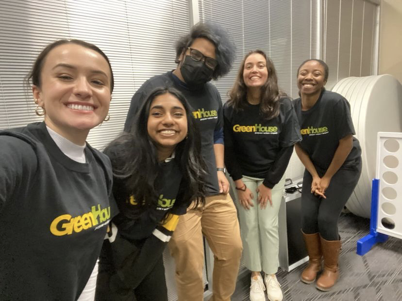
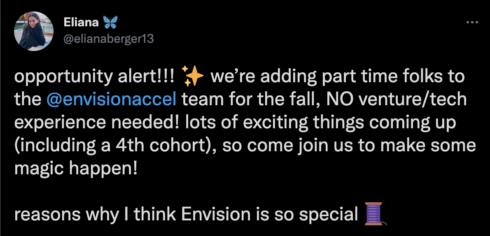
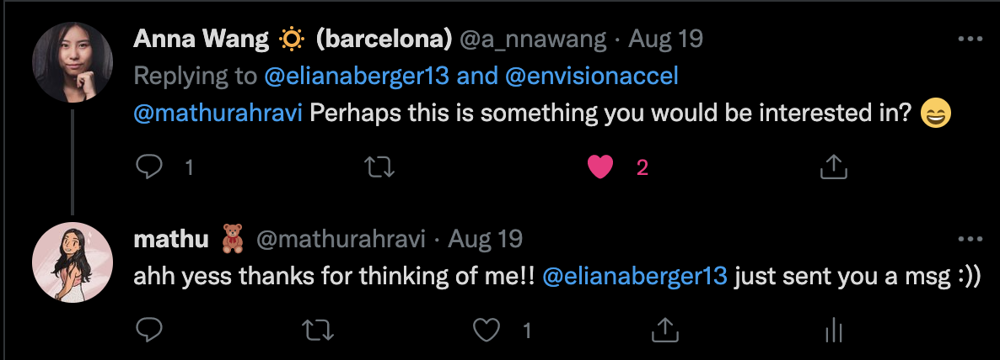
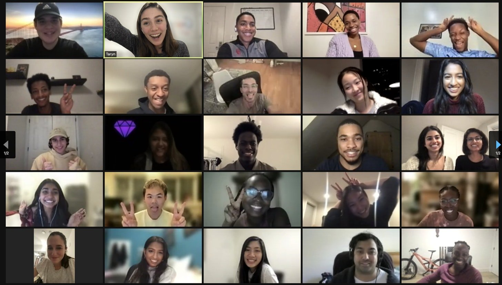
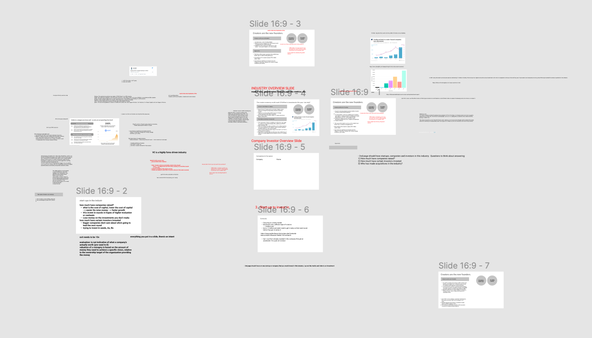
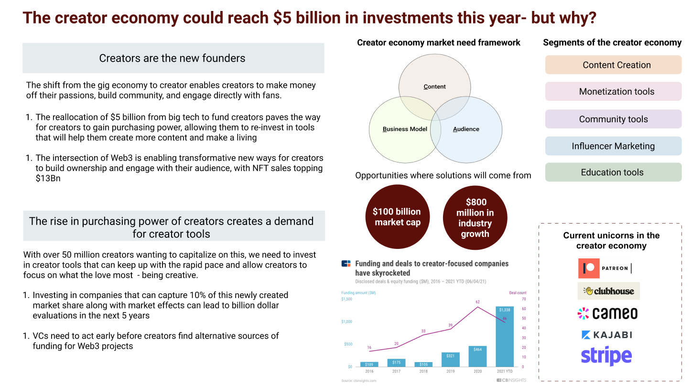

### A review of my first term back in person at Waterloo after 2 years.

That is the question I asked myself all term long - the killer term in systems design engineering that makes you question if you should be here in the first place.

This term also had a special place in my heart - the first time back on campus after almost two years of being separated from my class during the pandemic. Although things weren't completely back to normal, classes were operating on a hybrid model where you can attend lectures in person if you choose to once a week.

Since this was my first time back in person after a long time, I had a few goals this semester:

- I really wanted to take advantage of the different entrepreneurial resources on campus (ex. concept, greenhouse, problem pitch) and get involved in this space
- Prioritize my physical health and take fitness classes/go to the gym
- Meet more people in and outside of school

## school

**classes**

The classes I took this semester were:

- SYDE 252: linear systems and signals
- SYDE 212: statistics
- SYDE 292 & SYDE 292L: circuits lab & circuits class
- SYDE 262: engineering economics
- SYDE 286: mechanics of deformable solids

This was not my favourite term - I didn't have the flexibility to choose any of my classes this term and even one of the classes I thought would be the easiest (engineering economics) did a complete 180 with an ambiguous & complex final project. All of these classes were difficult in their own ways.

Given that most of these classes weren't things I was really interested in, related to the field I want to pursue in the future and I already had the average I needed for exchange, getting the highest grades weren't my biggest priority this term. I tried my best to pass the course and do as well as I can, but also tried to get involved in other areas.

Having the circuits class in person was a game-changer. In my last semester (2A), we had an engineering prototyping course where we had to program circuits/Arduino virtually. It was not fun to debug circuits on a video call (shoutout to my TA for helping out with it regardless!). With our labs being in person, it was so much easier to get help and be interactive with the course.

Although this class was difficult, having such a dedicated TA made a world of a difference increasing my confidence in the course and also my conceptual understanding of it. One of my biggest take aways was to always ask for help!

**In person classes**

This is something I wish I went to more. In-person classes are a great way to get to know more people. It was just difficult because we had so many assignments/tests for other courses and sometimes I would have different meetings for Envision that would be at the same time, so I used the class time to work on other things. Watching the recordings wasn't the same.

Going to classes in person also helps to timebox the time you spend on a course, whereas otherwise, you'll need to figure out how to fit in watching the recording with all the other things you need to do.

Something I learned was that if you start missing classes in person, you most likely won't continue going to classes. It takes a lot of momentum, so if you're consistent, you can continue going throughout the semester. Definitely something I'll do more of next term - and will need to especially if 3A is completely in person.

**Study spots**

I did take advantage of study spots in person! Although it was nice having my monitor at home, I felt a lot more productive studying on campus since it time blocks my work and makes home the place where I relax and eat dinner after a day of studying. Plus keeps you socially accountable with all the people around you!

Here are the notable mentions:

- Hagey Hall

  

  One of my favourites! It very bright, spacious, a ton of outlets, and not that busy. There's also a piano. The only con is that it's a lot farther away from everything else on campus, but it's easily reachable by bus since it's close to the UWaterloo bus stop.

- QNC
  

  Studying at QNC is awesome because it's right by the window - I've seen so many squirrels scurry by as I study. And there's a piano in the basement (I even played it one time this semester which was a fun experience!). I also enjoy studying here because I can easily get to PAC, and once I rented a locker it became easier to go to the gym after studying.

I also finally discovered how to use the indoor pathways so I can get to QNC/PAC all the way from E7 without going outside

**Fitness classes**

I bought a fitness pass for the term at Waterloo which allowed me to go to as many classes as I wanted to for the term. I tried to go at least 2-3 times a week, but on some weeks that were really busy I wasn't able to go.

These were some of the classes/active related things I did this term:

- Spin
- Barre classes
- UWaterloo Hiphop (the class I went to was a mixture of hip hop and bollywood, which was a mixture of the two best worlds!)
- I also auditioned for Fashion for Change which was a fun experience, but wasn't able to commit because of school and the fact that the show runs while I'm on co-op. Hope to get involved next year though!

I also started to go to pac occasionally mainly for cardio - I remember I felt so intimidated going to the gym for the first time (I'm more of a classpass person) but I realized everyone just focuses on themselves and there's nothing to worry about. Hope to continue going while I'm on my co-op term and build a routine for myself!

### getting involved with the entreprenurship community

Relating back to the goals I had into the semester, getting more involved in the entreprenuership community was one of them. Looking back, I realized most of the things I wrote about in my AIF about Waterloo - I didn't get a chance to experience yet!

**Greenhouse Social Innovators in Training program**

I joined the Greenhouse Social Innovators in training program to learn more about building social ventures. Greenhouse was such a supportive community (shoutout to Kate and Tania for being the most amazing mentors this term!) 

In this program, we met weekly learning about different aspects of entreprenuership (finding a problem, talking to customers, getting funding) and also shared where we were at in our own projects which was great for accountability.

I worked on a project to help those with English as an additional language improve communication skills for the workplace. If you're curious, you can watch the pitch video [here](https://lnkd.in/eCdmEMAK). We were lucky enough to win a microgrant, so excited to brainstorm ways we can use the funding to further our customer discovery work.

Overall met a lot of cool people and even got to go to a basketball game for the first time at Waterloo. Looking forward to staying involved with the community :))

**Envision Accelerator**

After my friend Anna miraculously tagged me in this tweet about an opportunity to support diverse founders and work on a student accelerator, everything changed.

I got to be part of and help cultivate a community of founders all over the world. With a core team of only 6 people running the magic behind the scenes, I got to apply what I've learned working on clubs at UWaterloo (CUTC & Tech+) and get to work on building out processes to help scale Envision.

Some of the work I did included helping build a wiki & investor database to streamline connections we make for our founders and democratize information, work on no-code tools, and work on content/partnership strategies for our cohort 5 launch.

I got to meet some of the most inspiring founders and listen to strategies about fundraising - even meeting founders who've raised pre-product & without a deck - just in awe of their storytelling skills.

I hope to be part of the Envision team for a long time - it really combines both of my worlds of creating opportunities for people with diverse backgrounds, democratizing knowledge, and making entreprenuership/tech more accessible.

S/O to Eliana, Taryn, JP, James, and Klare for being such amazing people to work with!

P.S if you made it this far and are working on something - we're accepting applications for our cohort 5 launch until Jan 10th! Apply [here](envisionaccelerator.com/apply) :)

### Learning more about Venture

I've always wanted to learn more about venture, but I don't think I got really serious about it until this term, and Envision really accelerated that.

I got the opportunity to go through the recruitment process with Harlem Capital for their part-time Winter internship, and wow this was a big learning experience.

I made it to the semi-final round where we had to create an industry overview slide deck in under a week. Making an industry deck for the first time, it took me an all-nighter and a bit of stress since it was also due right after the halloweekend.

**How it started**

**How it's going**

It was so satisfying to see the end final product of this! After all the slide iterations later, it finally came together. This picture is 1/3 of the slides - definitely a lot of improvements I can make here.

I didn't end up making it to the final round (of presenting the decks) unfortunately, but it was a huge learning experience. I'm also glad I went all out and spent a lot of time on this, because I would've regretted it otherwise. Here are some of my key takeaways:

1. I learned a lot about the creator economy space! I spent the whole weekend learning from Li Jin and other prominent leaders in the space, and have a lot more empathy for creators and understand what tools they need to succeed.
2. A lot about the VC role is learning things quickly - learning about a completely new space, understanding the gaps, what's already there in the market, and what can be built next.
3. First I need to find data, then figure out what out of this noise is relevant, and finally make my own conclusions on the data. People need to be able to read my slide and clearly understand the implication (or the "so what?") behind every bullet I write.
   1. A lot of this is related to some of the skills I've gained as a PM, but instead of navigating through customer interviews, I'm learning from external sources.

**Facing rejection**

I didn't expect to make it into venture with just my first time applying, but it was definitely an inflection point. Along with this and rejections from other student venture clubs, I wasn't sure where to go from here.

I opened up about it to my friend Taryn from Envision, and she was so kind to connect me with Mia who knew someone at Cowboy ventures that was looking for a part-time intern. I realized it goes a long way to be vulnerable - you won't know what other opportunities could arise if you don't ask for help!

I'm now interning part-time at Cowboy ventures this winter, and I'm really excited about it. My manager is also a woman in venture & Canadian so I can't wait to learn from her.

Shoutout to the Envision team for their support on this, along with Dominic from Ripple Ventures, and Mackenzie for all his feedback and sharing his insights as a founder in the creator economy space.

## Social stuff!

Not going to lie, but with all this other stuff going on I didn't get to make as much time for social things this semester, but I still had fun regardless!

Lyn (from Cansbridge) along with Diana hosted a #hotgirlhalloween celebration which was so much fun!! It was so cool to be in a space with some of the most brilliiant and inspiring entreprenuers, students & builders all in one room.

I also appreciated being in a safe space where we can be the most authentic selves and dress however we wanted to. Thank you Lyn & Diana for making this one of the highlights of this term and all the effort you went into planning such a awesome night :)

I also went to a pinksweats concert with some friends and the vibes were amazing. It was surreal to finally be able to listen to live music again.

Some other fun mentions include going to a Harry Potter trivia night, making croquettes & cutlets, and spontaenous outtings to get all the free wealthsimple food deals on campus. We also played the ukulele in e7 one time which was really fun!

Not sure what the next term will look like in terms but hope to host more things like book clubs or jam sessions on the ukulele! I wished I had more time to plan things with the SYDE 26 and SYDE 24 classes, but hopefully there will be more opportunities to do this in the summer!

---

## parting words

Overall, this was a jam-packed term full of circuits, learning about new fields, wealthsimple baos, and discovering study spots on campus.

Thanks to everyone who's made it such a great term!! Grateful for all I've learned and looking forward to experiencing even more growth interning at CommandBar and Cowboy VC this winter!

If you like reading things like this, let me know :) Would love to hear what everyone else has been learning and might share pieces like this more often!
