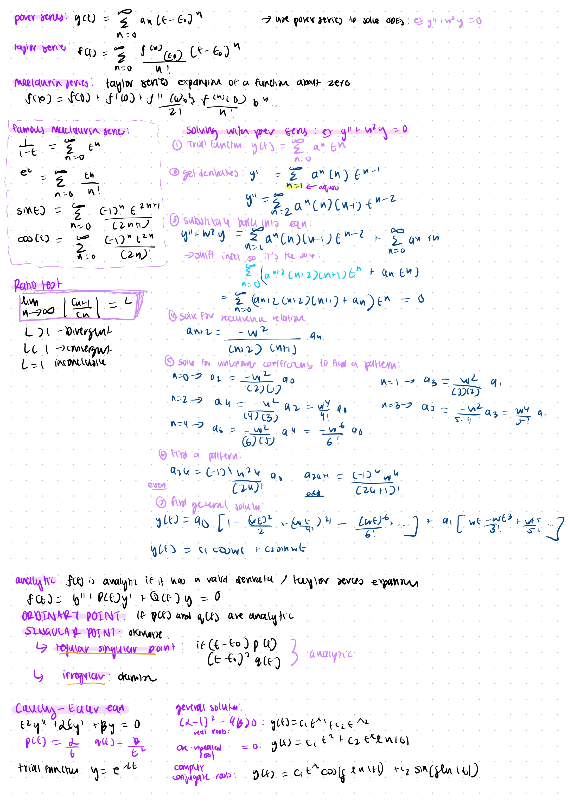
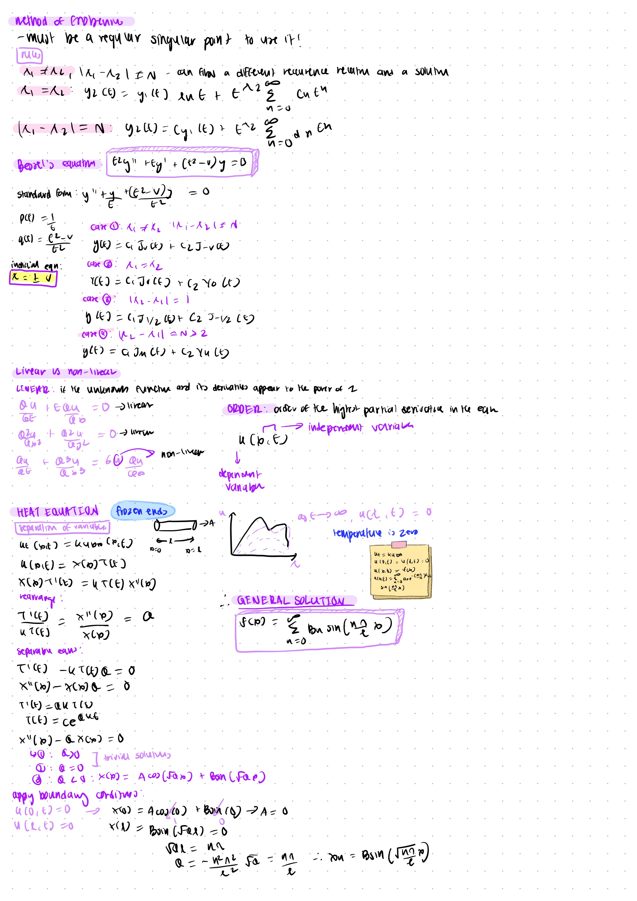
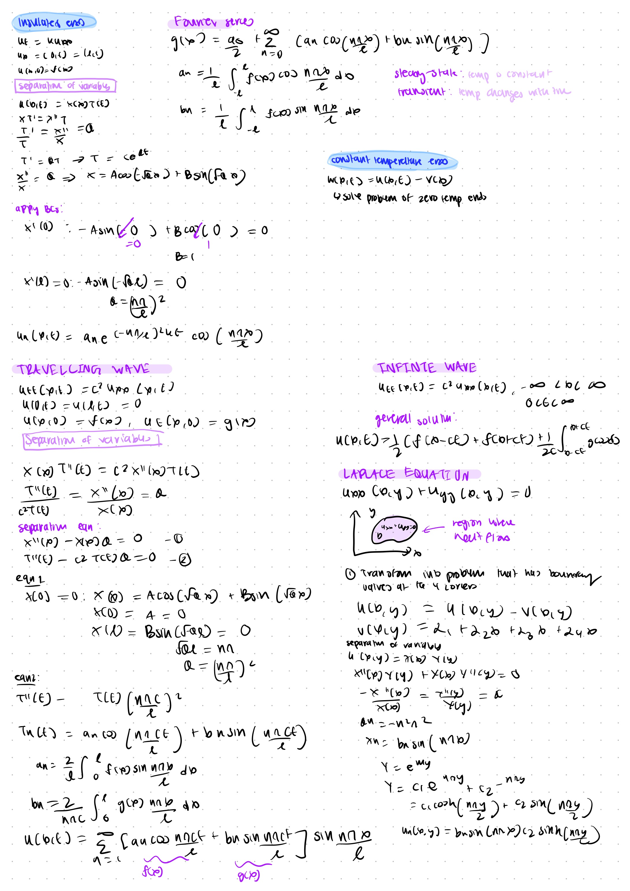
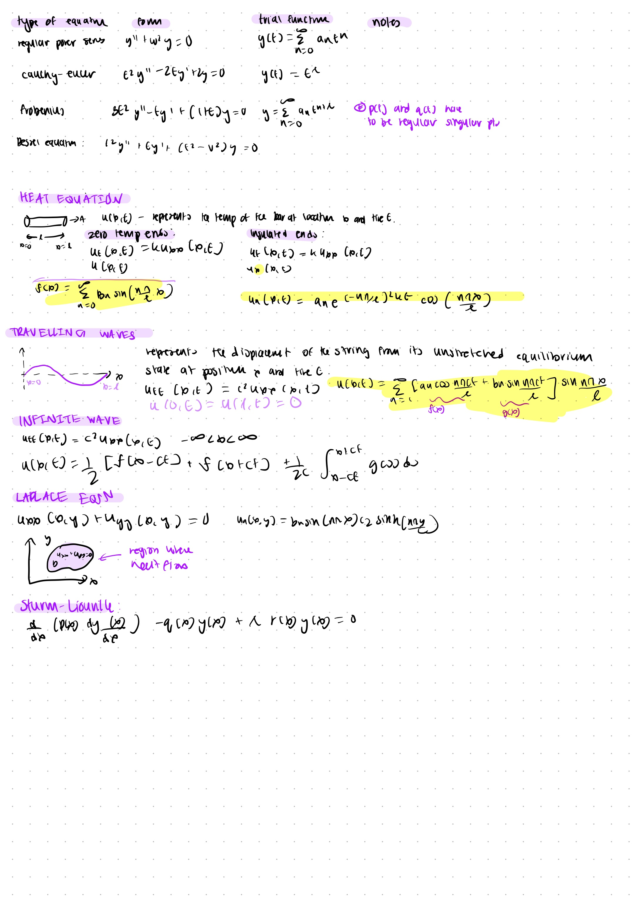
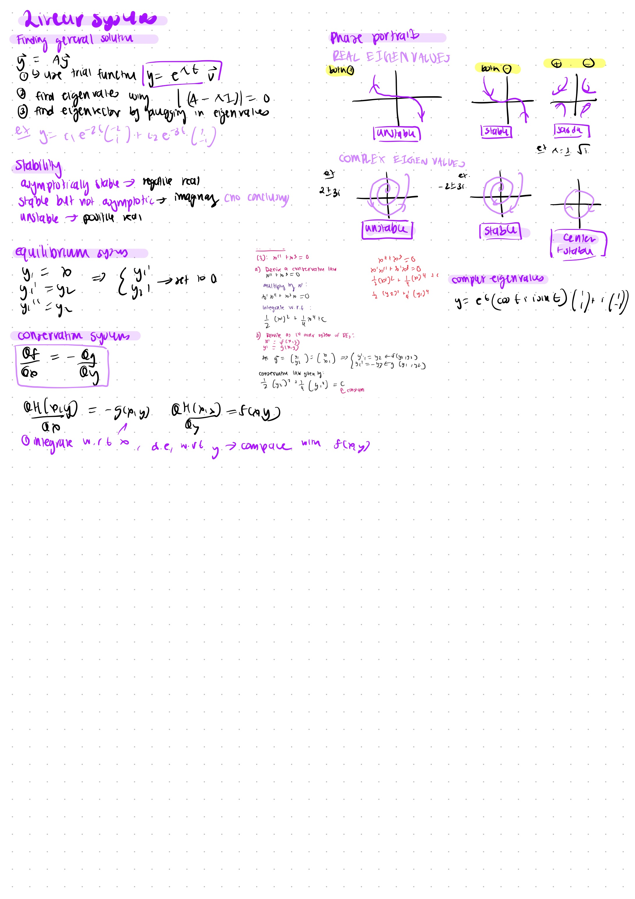

## topics covered:

- [ ] regular power series
- [ ] convergence
- [ ] cauchey euler
- [ ] shifting terms
- [ ] frobenius
- [ ] bessel equation
- [ ] linearity and order
- [ ] heat equation
  - [ ] frozen ends
  - [ ] insulated ends
  - [ ] separation of variables
  - [ ] constant ends
- [ ] wave equation
- [ ] travelling wave
- [ ] laplace equation
- [ ] sturm liouville
- [ ] change of independent variable
- [ ] euler
- [ ] runge kutta

