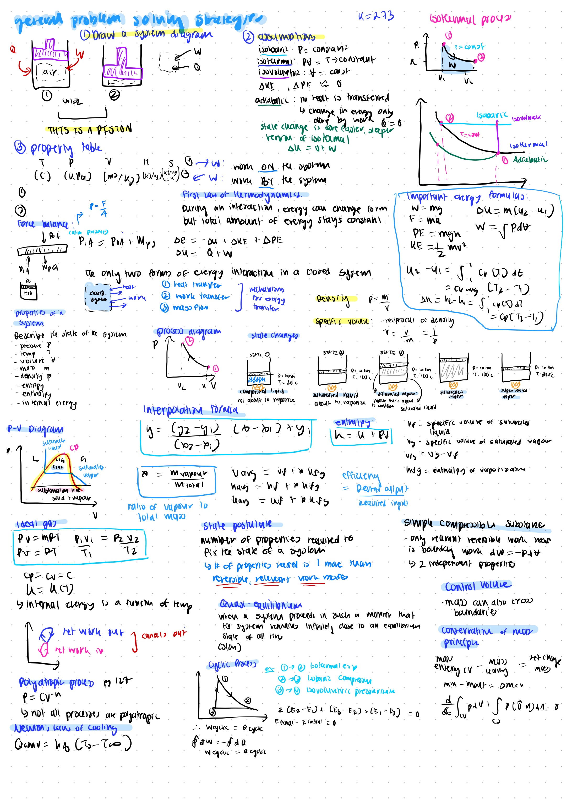

SYDE 381 was an interesting course on the fundamentals of thermodynamics. I learned about the conservation of mass, 1st and 2nd law of dynamics, dealing with Single State Single Flow (SSSF) and Uniform State Uniform Flow (USUF) systems.

It was also quite interesting to learn how you can visualize heat transfer problems using "heat-transfer circuits".

I genereally really enjoyed this course - it's quite easy to follow especially with the textbook, most of the exam material is similar to tutorials, and Prof. Fraser is a great prof.

In my year, we were allowed a 2 pages of crib sheets, so this was one of the summary pages I made for the course.

